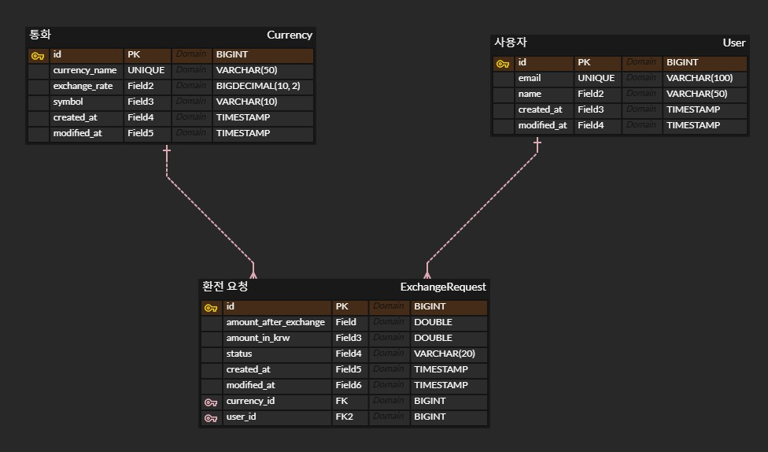

## API 명세서

- **1. 사용자 생성**
    - URL: POST /users
    - Description: 새로운 사용자를 생성합니다.
- **Request Body**:

```json
{
  "email": "kkk@gmail.com",
  "name": "kim"
}
```

- **Response**:
    - Status 201 created:

```json
{
  "id": 1,
  "email": "kkk@gmail.com",
  "name": "kim",
  "created_at": "2024-11-18T16:42:03.000Z",
  "modified_at": "2024-11-18T16:42:03.000Z"
}
```

- **Response**:
    - Status 400 Bad Request:

```json
{
  "errorCode": "USER001",
  "errorMessage": "Invalid email format."
}

```

- **2. 특정 사용자의 환전 내역 조회**
    - URL: GET /exchanges/{userId}
    - Description: 특정 사용자가 수행한 모든 환전 요청 내역을 조회합니다.
    - Path Parameter:
        - userId (Long): 사용자 고유 식별자.
- **Response**:
    - Status 200 OK:

```json
[
  {
    "id": 1,
    "amountInKrw": 10000,
    "amountAfterExchange": 8.76,
    "currencyName": "USD",
    "status": "normal",
    "createdAt": "2024-11-18T16:42:03.000000"
  },
  {
    "id": 2,
    "amountInKrw": 5000,
    "amountAfterExchange": 4.38,
    "currencyName": "USD",
    "status": "cancelled",
    "createdAt": "2024-11-18T17:00:03.000000"
  }
]
```

- Status 404 Not Found:

```json
{
  "errorCode": "EXC001",
  "errorMessage": "User not found."
}

```

- **3. 환전 요청 생성**
    - URL: POST /exchanges
    - Description: 새로운 환전 요청을 생성합니다.
- **Request Body**:

```json
{
  "userId": 1,
  "currencyId": 1,
  "amountInKrw": 10000
}
```

- **Response**:
    - Status 201 Created:

```json
{
  "id": 1,
  "amountInKrw": 10000,
  "amountAfterExchange": 8.76,
  "currencyName": "USD",
  "status": "normal",
  "createdAt": "2024-11-18T16:42:03.000000"
}
```

- Status 400 Bad Request:

```json
{
  "errorCode": "EXC002",
  "errorMessage": "Invalid amount or currency ID."
}
```

- **4. 환전 요청 상태 변경**
    - URL: PUT /exchanges/{id}
    - Description: 특정 환전 요청의 상태를 변경합니다 (예: 취소).
    - Path Parameter:
    - id: 환전 요청 고유 식별자.
        - Request Body:

```json
{
  "status": "cancelled"
}
```

- Response:
    - Status 200 OK:

```json
{
  "id": 1,
  "status": "cancelled",
  "modifiedAt": "2024-11-18T17:00:03.000000"
}
```

- Status 404 Not Found:

```json
{
  "errorCode": "EXC003",
  "errorMessage": "Exchange request not found."
}
```

- **5. 사용자 삭제**
    - URL: DELETE /api/users/{id}
    - Description: 특정 사용자를 삭제하고 해당 사용자의 환전 요청도 삭제합니다.
    - Path Parameter:
        - id: 사용자 고유 식별자.
- Response:
  - Status 204 No Content
  - Status 404 Not Found:
```json
{
  "errorCode": "USER002",
  "errorMessage": "User not found."
}
```

